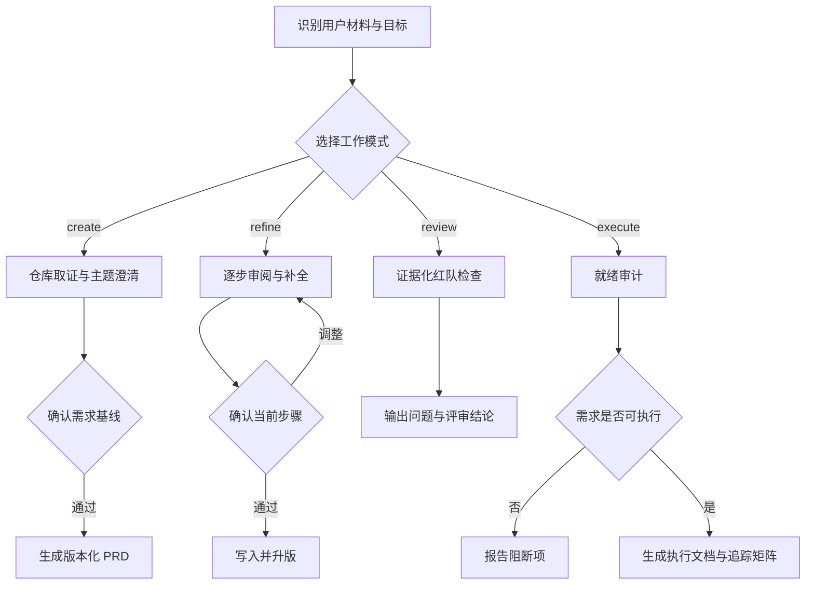

# PRD Lifecycle Skill

面向产品需求文档全生命周期的 Codex Skill。它把 PRD 创建、分步补全、证据化红队评审和开发执行规划统一到一个入口，并通过确认门禁保护业务决策、版本基线与代码边界。

> 能力边界：本 Skill 负责需求定义、评审与执行规划，不直接修改业务代码。进入下一模式必须由用户明确请求或确认。

## 业务功能

| 模式 | 业务功能 | 典型输入 | 主要产物 |
| --- | --- | --- | --- |
| `create` | 基于仓库事实把产品构想转为可验收需求 | 功能构想、现有仓库 | 现状报告、需求确认基线、版本化 PRD |
| `refine` | 分步骤补全和精修已有需求 | PRD 或需求草稿 | 修订稿、版本历史、可选 Word 文档 |
| `review` | 对目标 PRD 做证据化红队审查 | 指定 PRD、可选仓库证据 | 分级问题、证据、影响与修订建议 |
| `execute` | 把已批准 PRD 转成可控开发计划 | 已批准 PRD、现有仓库 | 就绪审计、执行文档、追踪矩阵、控制提示词 |

四种模式共享事实与建议标签、权威顺序、版本管理和授权边界，但各自有独立的完成标准。

### 关键机制

| 机制 | 作用 |
| --- | --- |
| 权威顺序 | 冲突按「用户指令 > 本次确认决定 > 批准基线/PRD > 代码现状 > 产品文档 > 历史记录」裁决，不静默选边 |
| 事实标签 | 用 `已确认`、`代码事实`、`文档事实`、`产品假设`、`技术建议`、`待确认`、`本期不实现` 区分事实与判断 |
| 版本管理 | 每次确认后才写入并升版，不静默覆盖历史版本 |
| 追踪矩阵 | `execute` 模式把 FR/AC 映射到开发阶段、代码区域、测试和证据 |
| 门禁衔接 | 各模式不自动串行穿透，进入下一模式必须显式授权 |

## 使用场景

- 只有产品构想，需要结合现有系统形成正式 PRD。
- 已有 PRD 草稿，需要逐章补全用户故事、功能方案、边界和验收标准。
- 需要找出需求中的矛盾、遗漏、回归风险或不可验收项，但暂不代改。
- 已有明确批准版本，需要转换为 Codex 可分阶段执行的开发控制文档。
- 多轮产品、研发和管理层协作中，需要保留决策、版本和追踪关系。

若只是现有仓库中的局部代码改动，并且重点是比较方案后实施，优先使用 `repo-grounded-change`。

## 使用范例

### 范例一：从构想创建 PRD（`create`）

**输入：** 用户说「我们想给现有的 SaaS 后台加一个多租户权限模块，帮我写一份 PRD」。

**流程：** Skill 先检查仓库现状与工作树，发现现有系统已有单租户角色模型，再按证据缺口逐轮澄清（每轮一个主题），确认目标租户形态、隔离级别和权限继承规则后生成需求确认基线，用户批准后才产出版本化 PRD。

**产物：** 现状报告 → 需求确认基线 → `PRD-v1.0`（含范围、非目标、FR/AC、仓库影响证据）。

### 范例二：分步补全草稿（`refine`）

**输入：** 用户提供一份只有概述的需求草稿。

**流程：** Skill 建立工作基线（`v1.0`），按「需求澄清与用户故事 → 功能方案 → 边界条件 → 验收标准」四步逐段产出并等待确认，每确认一步 minor 升版；用户补充合规和风险回滚要求时插入扩展步骤，最终整稿合并 major 升版，并可导出 `.docx`。

**产物：** `PRD-v1.1` → `v1.2` → … → `v2.0`，每版带修订记录。

### 范例三：红队评审（`review`）

**输入：** 用户指定 `docs/PRD-v1.2.md` 并说「只审，不改」。

**流程：** Skill 只读完整 PRD，提取状态、阈值、权限、时间、优先级和验收不变量，按发现分类法检查基线回归、内部一致性、生命周期、数据历史、接口幂等、权限审计等，去重后只保留有证据、有后果、可修正的问题。

**产物：** 分级发现清单（每条含证据、影响、最小修正建议）+ 结论 `Pass / Pass with changes / Blocked / Limited review`。

### 范例四：转开发执行文档（`execute`）

**输入：** 用户指定已批准的 `PRD-v2.0` 和本次发布范围。

**流程：** Skill 先做就绪审计，发现有一处验收标准不可观察，结论为 `BLOCKED` 并停下；用户补充可观察验收条件后，再生成最小架构边界、分阶段计划（从只读 Phase 0 开始）和 FR/AC 追踪矩阵，最后输出总控提示词与单阶段提示词。

**产物：** 就绪审计 → 开发执行文档 → 追踪矩阵 → 控制提示词。

## 调用指令

创建 PRD：

```text
$prd-lifecycle 根据当前仓库和这个产品构想创建一份 PRD
```

补全草稿：

```text
$prd-lifecycle 分步完善 docs/PRD-draft.md，每一部分经我确认后再写入并升版
```

红队评审：

```text
$prd-lifecycle 红队评审 docs/PRD-v1.2.md，只输出问题、证据、影响和最小修正建议
```

生成执行文档：

```text
$prd-lifecycle 把已批准的 PRD-v2.0 转为 Codex 开发执行文档，并生成 FR/AC 追踪矩阵
```

也可以直接描述「创建、补全、评审或转化 PRD」的任务，由 Codex 根据 `SKILL.md` 自动选择模式。调用时最好明确目标文件、版本状态、当前仓库和期望产物。

## 工作流程



`create`、`refine`、`review`、`execute` 不会自动串行穿透。比如评审完成不代表文档已获修订授权，执行计划完成也不代表已获代码实施授权。

## 业务价值

- **提升需求质量**：把模糊构想转换为范围明确、可观察、可验收的需求，减少开发阶段的返工。
- **减少决策失真**：显式区分用户决定、代码事实、文档事实、产品假设和技术建议，避免把推测写成需求。
- **控制版本风险**：每次确认后再写入和升版，避免静默覆盖与决策丢失，保留可审计的演进历史。
- **提前暴露问题**：红队评审在开发前发现冲突、遗漏、权限和状态生命周期风险，降低实现阶段的隐性成本。
- **打通需求到交付**：用 FR/AC 追踪矩阵把批准需求映射到开发阶段、代码区域、测试和证据，识别孤儿需求与越权工作。
- **守住授权边界**：各阶段门禁确保「评审不等于代改、计划不等于实施」，保护业务决策不被自动执行。

## 安装

```text
$HOME/.agents/skills/prd-lifecycle/SKILL.md
```

项目级安装：

```text
<项目目录>/.agents/skills/prd-lifecycle/SKILL.md
```

Codex 通常会自动发现 Skill；如果未出现，请重启 Codex。

## 仓库结构

| 路径 | 说明 |
| --- | --- |
| `SKILL.md` | 模式路由、权限边界和主流程 |
| `references/` | 澄清、版本管理、评审、就绪审计和执行文档规范 |
| `scripts/prd_doc.py` | PRD 初始化、升版与导出辅助脚本 |
| `agents/openai.yaml` | Codex 中的 Skill 展示配置 |

## 相关文档

- [Skill 主说明](./SKILL.md)
- [项目取证](./references/project-discovery.md)
- [版本管理](./references/versioning.md)
- [执行文档规范](./references/execution-document.md)
- [OpenAI：Build skills](https://developers.openai.com/codex/skills)